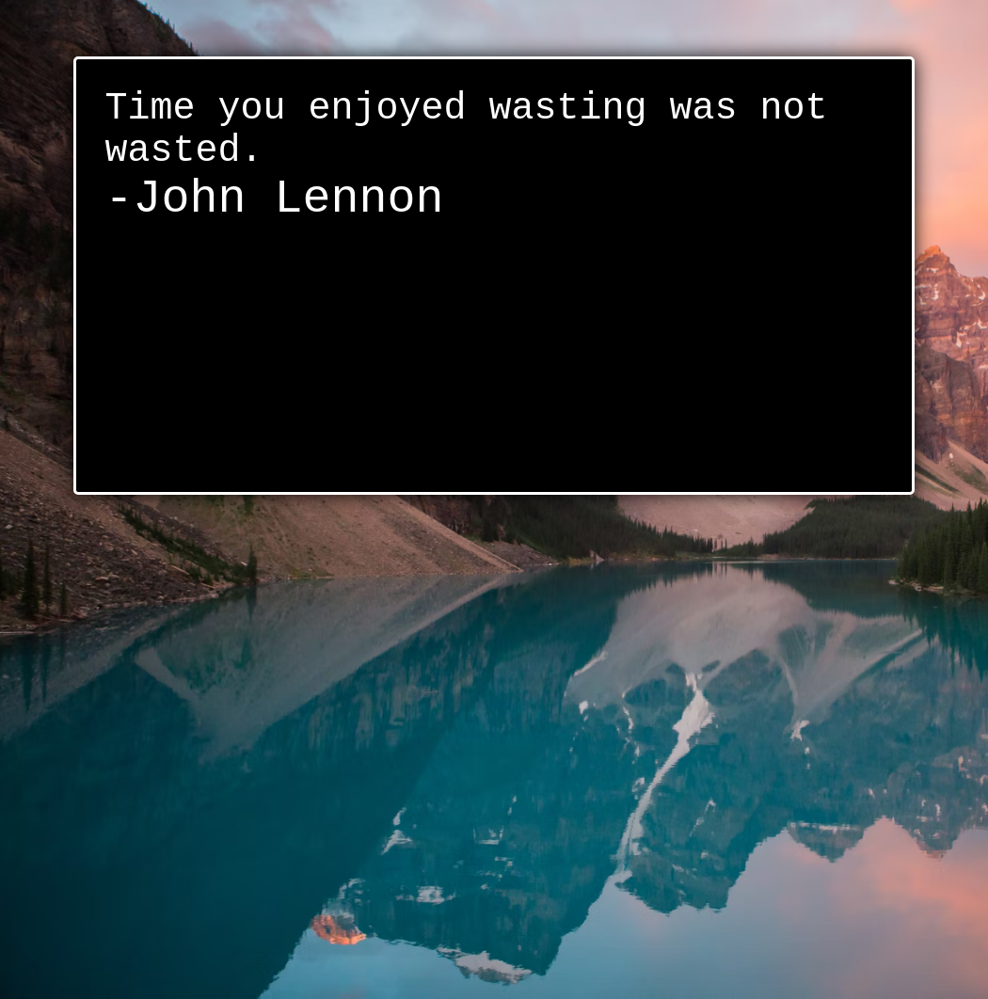

## Hello! 🤙

 
  

  

I love to make cool things (try to at least!), and I consider myself a fairly curious person. 
My goal is to help make tools for developers to make their lives easier and to create new projects that help benefit society and solve problems that more than just the developer community can benefit from!

You can find some of my other work @ [Marketing Pipeline](https://github.com/MarketingPipeline/)

---
### You can sponsor my work SOON through [GitHub sponsors.](https://github.com/sponsors/)

Cheers!   

   This image was dynamically generated ⤴️  
   come back later for a tutorial on how to make your own!

<!--------Hidden-----

 

